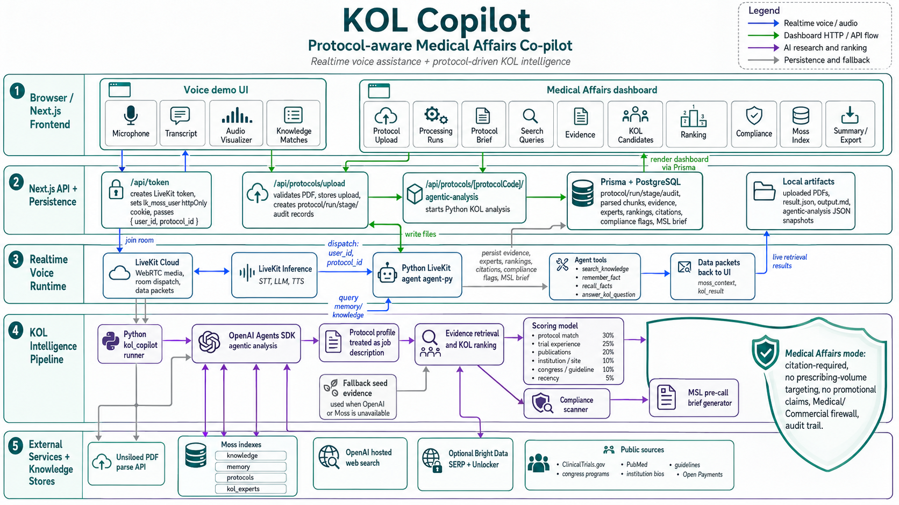

# KOL Copilot

KOL Copilot is a hackathon MVP for a protocol-aware Medical Affairs co-pilot. It helps pharma Medical Affairs and late-stage Clinical Development teams identify, rank, and prepare compliant engagement with relevant KOLs, investigators, sites, and medical experts for Phase 3 and launch-readiness programs.

The product answers:

> Given this clinical trial protocol, who are the most relevant KOLs, investigators, sites, and medical experts, why do they matter, and what compliant action should the Medical Affairs team take next?

The demo is built around a realtime voice workflow: a user discusses a Phase 3 protocol naturally, the agent retrieves expert evidence, ranks relevant KOLs, streams structured results to the UI, and can draft a compliant MSL pre-call brief.

## Demo Workflow

1. Upload or select a Phase 3 protocol PDF.
2. Extract protocol attributes such as indication, intervention, phase, patient population, geography, endpoints, inclusion/exclusion criteria, and relevant specialties.
3. Ask a voice question:

   > Find the top infectious disease KOLs for this protocol. Prioritize vaccine trial experience, immunogenicity publications, and adult COVID study relevance.

4. Retrieve relevant expert evidence from protocol chunks, expert profiles, publication snippets, trial records, and supporting sources.
5. Rank experts with an explainable scoring model.
6. Display ranked KOL cards with citations, rationale, score breakdowns, and compliance notes.
7. Ask follow-ups such as:

   > Why is Dr. X ranked above Dr. Y?

8. Generate a compliant MSL pre-call brief with scientific background, source citations, suggested non-promotional questions, and compliance warnings.

## Architecture



```text
Frontend
  - Next.js voice interface
  - protocol upload and dashboard
  - live ranked KOL cards
  - evidence drawer
  - compliance panel

Voice + Agent Runtime
  - LiveKit realtime audio session
  - Python LiveKit agent
  - OpenAI Agents KOL workflow
  - structured data events for UI updates

Backend / Workflow
  - protocol-aware query runner
  - retrieval orchestration
  - expert ranking
  - compliance checker
  - MSL brief generator
  - optional FastAPI endpoint at /kol/query

Knowledge Base
  - Moss protocol index
  - Moss expert index
  - trial records
  - publication snippets
  - payment/transparency snippets
  - guideline/congress snippets
```

The browser connects to LiveKit for realtime audio. LiveKit dispatches the Python agent in `agent-py/`, which can call Moss retrieval tools and the in-process KOL Copilot runner. The runner emits structured `kol_result` data events so the Next.js UI can update ranked cards, citations, and compliance notes without waiting for a static final answer.

## Repository Layout

```text
KOL-Copilot-Hackathon/
├── KOLCopilot-Arch.png        # architecture diagram referenced above
├── AGENTS.md                  # product brief and project instructions
├── agent-py/                  # Python LiveKit voice agent and KOL workflow
│   ├── src/agent.py           # LiveKit agent, Moss tools, KOL bridge
│   ├── src/create_index.py    # Moss index creation and seeding
│   └── src/kol_copilot/       # protocol-aware KOL workflow package
│       ├── runner.py          # main query runner used by voice and API paths
│       ├── api.py             # optional FastAPI endpoint
│       ├── agents.py          # OpenAI Agents definitions
│       ├── tools.py           # retrieval and workflow tools
│       └── schemas.py         # structured result models
├── frontend/                  # Next.js realtime voice and KOL UI
│   ├── app/                   # app routes, dashboard, token endpoint
│   ├── components/app/        # app shell, landing, Moss/KOL result panels
│   └── hooks/                 # LiveKit and Moss data-event hooks
└── package.json               # root scripts for setup, dev, indexing, tests
```

## Core Components

- **LiveKit:** realtime voice conversation, audio transport, agent dispatch, and session infrastructure.
- **Moss:** semantic retrieval over protocol chunks, expert profiles, publication snippets, clinical trial records, and evidence snippets.
- **OpenAI Agents SDK:** protocol-aware KOL workflow, ranking rationale, comparison answers, and MSL brief generation.
- **Next.js frontend:** voice UI, upload/dashboard surface, live KOL cards, evidence context, and compliance panel.
- **FastAPI optional API:** HTTP access to the same KOL runner at `POST /kol/query`.

## Ranking Model

The MVP uses a simple explainable score so every recommendation can be traced back to evidence:

```text
KOL Score =
  30% protocol match
+ 25% trial investigator experience
+ 20% publication relevance
+ 10% institution/site relevance
+ 10% congress/guideline influence
+  5% recency
- compliance/conflict risk adjustments
```

The weights can be hardcoded for the hackathon. The important requirement is that each score includes visible evidence and citations.

## Compliance Guardrails

KOL Copilot is Medical Affairs software, not sales targeting software.

Do not produce outputs like:

- "This doctor is likely to prescribe."
- "Target this physician before approval."
- "Use this KOL to drive commercial adoption."

Prefer language like:

- "This expert is scientifically relevant to the protocol."
- "This investigator has related trial experience."
- "This MSL conversation should remain non-promotional."
- "Suggested questions are for scientific exchange only."

Required guardrails:

- Medical Affairs mode by default.
- Citation-required recommendations.
- No pre-approval promotional language.
- No prescribing-volume targeting.
- Clear Medical/Commercial firewall.
- Audit trail for recommendations.
- Compliance warning section in generated briefs.

## Prerequisites

- Python 3.10+ and [uv](https://docs.astral.sh/uv/).
- Node.js 22+ and [pnpm](https://pnpm.io) 10+.
- [LiveKit CLI](https://docs.livekit.io/reference/developer-tools/livekit-cli/) authenticated to a LiveKit Cloud project.
- LiveKit Cloud account/project.
- Moss account and API credentials.
- Optional `OPENAI_API_KEY` for the OpenAI Agents SDK path. Without it, the KOL runner can fall back to deterministic synthetic evidence for demo rendering.

Never hand-write LiveKit keys. Use the LiveKit CLI to write LiveKit environment values.

## Setup

Install dependencies and create local env files:

```bash
pnpm setup
```

Write LiveKit credentials into both apps:

```bash
lk app env -w agent-py
lk app env -w frontend
```

Add Moss and optional OpenAI credentials to `agent-py/.env.local`:

```dotenv
MOSS_PROJECT_ID=your_moss_project_id
MOSS_PROJECT_KEY=your_moss_project_key
MOSS_INDEX_NAME=knowledge
MOSS_MEMORY_INDEX_NAME=memory
MOSS_PROTOCOL_INDEX_NAME=protocols
MOSS_EXPERT_INDEX_NAME=kol_experts
MOSS_MODEL_ID=moss-minilm
OPENAI_API_KEY=optional_openai_api_key_for_kol_copilot
```

The frontend only needs LiveKit credentials and the agent dispatch name. It does not need Moss credentials.

## Build Indexes

```bash
pnpm moss:index
```

This runs `agent-py/src/create_index.py` and prepares the Moss indexes used by the realtime workflow. The KOL workflow expects protocol and expert evidence to be available in the configured Moss indexes; for hackathon speed, seed a curated dataset around one indication instead of trying to build a full pharma data warehouse.

Recommended seed size:

- 20-40 expert profiles.
- 50-150 evidence snippets.
- ClinicalTrials.gov investigator/site records.
- PubMed abstracts and publication snippets.
- Guideline, congress, institution, and transparency snippets where useful.

## Run

Start the voice agent and frontend together:

```bash
pnpm dev
```

- Frontend: http://localhost:3000
- Python LiveKit agent: `agent-py`, dispatched by the frontend token route.

No-frontend terminal smoke test:

```bash
pnpm agent:py:console
```

Optional KOL Copilot HTTP API:

```bash
pnpm agent:py:api
```

Then POST to `http://localhost:8000/kol/query`:

```json
{
  "user_text": "Find the top infectious disease KOLs for this protocol.",
  "user_id": "demo-user"
}
```

The LiveKit worker does not need the HTTP API for voice. It imports `kol_copilot.runner.run_kol_query` directly to keep the realtime path low-latency.

## Reference Protocol

The initial reference protocol is the Pfizer/BioNTech BNT162b2 Phase 3 COVID-19 vaccine protocol:

- ClinicalTrials.gov document: `https://cdn.clinicaltrials.gov/large-docs/69/NCT04816669/Prot_000.pdf`
- Trial: Pfizer/BioNTech BNT162b2 COVID-19 vaccine
- Phase: 3
- Indication: COVID-19 prevention
- Intervention: BNT162b2 RNA-based COVID-19 vaccine
- Population: healthy adults 18-55
- Focus areas: safety, tolerability, immunogenicity
- Relevant specialties: infectious disease, vaccinology, immunology, clinical trial investigators

For a more pharma/KOL-friendly demo, a synthetic Phase 3 protocol in oncology, lupus nephritis, obesity, or Alzheimer's disease is also acceptable.

## Test, Lint, Format

```bash
pnpm test
pnpm lint
pnpm format
```

## Root Scripts

| Script | What it does |
| --- | --- |
| `pnpm setup` | Install frontend dependencies, sync the Python agent with `uv`, and copy local env files. |
| `pnpm moss:index` | Build Moss indexes through `agent-py/src/create_index.py`. |
| `pnpm dev` | Run the Python agent and Next.js frontend together. |
| `pnpm agent:py:console` | Run the voice agent in terminal console mode. |
| `pnpm agent:py:api` | Start the optional FastAPI KOL endpoint on port 8000. |
| `pnpm agent:py:start` | Run the Python agent in production start mode. |
| `pnpm agent:py:download-files` | Download LiveKit agent model assets. |
| `pnpm build` | Build the frontend. |
| `pnpm start:frontend` | Serve the built frontend. |
| `pnpm test` | Run Python tests. |
| `pnpm lint` | Run Python and frontend lint commands. |
| `pnpm format` | Format frontend and Python code. |

## Demo Success Criteria

The demo should prove:

- A Phase 3 protocol can drive expert retrieval.
- A voice agent can answer nuanced Medical Affairs questions.
- KOL recommendations are evidence-backed and explainable.
- Compliance guardrails are visible in the workflow.
- The experience is more useful than a static KOL list.

Closing line:

> KOL Copilot turns "find the right doctors" into a compliant, explainable, protocol-aware workflow for Medical Affairs and Phase 3 teams.

## License

MIT. See [LICENSE](./LICENSE).
